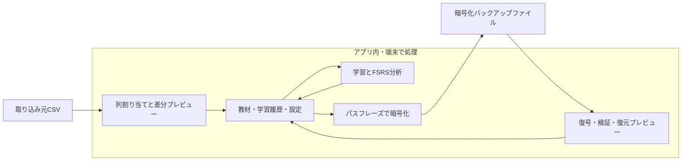

# 単語帳アプリ 初版の設計

更新日: 2026-09-09

2026-09-09にユーザーが技術構成と補足仕様を含む設計全体を確認し、合意した初版の設計。同日の実装指示に基づき開発へ移った。実装と動作確認の結果は[進捗](implementation-status.md)に記録する。Ubuntuの具体的な利用環境は未定として扱い、暫定基準と実際の検証対象を区別する。判断の経緯は[設計対話](design-interview.md)、用語は[CONTEXT.md](../CONTEXT.md)に記録している。

## 1. 確定した製品の範囲

| 項目 | 内容 |
| --- | --- |
| 利用者 | 本人と数人。各自がCSVを取り込み、独立して学習する |
| 端末 | Windows 11・Intel系、Ubuntu系、macOS。3 OSとも必須 |
| 想定規模 | 1デッキ1000行未満。これは利用規模であり、1000行目を切り捨てる上限仕様ではない |
| 教材 | CSVから問題・答え・解説、必要に応じて選択肢と任意のID列を選ぶ |
| 表現 | 改行を含むプレーンテキスト。問題と答えが必須、解説は空欄可。アプリ内で編集可能 |
| 学習 | 1行1カード。問題を表示し、答えと解説を見て4段階で自己評価する |
| FSRS | 復習時期の決定、目標保持率、個別の推定忘却曲線、復習量予測、端末内での個人向け調整 |
| 初期設定 | 目標保持率90%、新規20枚/日。設定を変更可能とし、当日限定の枚数上乗せを提供する |
| 学習日の切り替え | 午前4時を初期値とし、設定で変更可能にする |
| CSV更新 | 差分プレビュー、同じカードの履歴保持、CSVから消えたカードの保持 |
| データ保護 | 端末内はOSの暗号化とログイン保護に委ねる。持ち出すバックアップはアプリで暗号化する |
| バックアップ | パスフレーズ方式。全単語帳・学習履歴・FSRS設定を3 OS間で全体復元できる |
| 通信と更新 | アプリによる通信なし。新しいインストーラを手動で適用する |

Anki形式の互換性と、利用者・PC間の履歴統合は初版に含めない。

## 2. 利用者の操作

### CSVから作る・更新する

1. CSVと、作成先または更新先の単語帳を選ぶ。
2. 表を見ながら問題・答え・解説・任意ID・選択肢の列を割り当てる。選択肢を1列にまとめたCSVは、セル全体の表示、改行区切り、指定した文字列での区切りを選べる。
3. カードの表示例と、新規・更新・変更なし・要確認の件数を確認する。
4. 更新する値の変更前後を確認し、適用する。
5. 単語帳に戻り、学習を始める。

同じ単語帳内では、ID列を使う場合はID、使わない場合は問題文の完全一致で照合する。複数候補があるカードを勝手に更新しない。IDなしで問題文を変更した場合は、新規候補になる。アプリ内で問題文を変更してから古いCSVを再取り込んだ場合も同じルールを適用する。

IDなしでは問題文が完全一致する行を1枚にまとめる。IDありでは同じID・同じ問題文の行をまとめ、異なるIDは別カードとして扱う。答え・解説は同一内容を一度だけ残し、異なる内容を出現順に空行で区切って保持する。選択肢も同一内容の重複を除いて出現順に保持する。プレビューには統合した行数・元の行番号・異なる答えや解説をまとめた旨と最終内容を表示する。

ID列を選択したときの空ID・同じIDに異なる問題文がある場合、既存の候補が複数ある場合、必須内容の空欄、壊れたCSVは行単位で示し、解消するまで適用を行わない。適用は一括して成功するか、現在の状態を保って失敗するかのどちらかとする。CSVの読み込みではUTF-8、UTF-8 BOM、Windowsで使われるCP932の選択とプレビューを用意する。

更新時はカードの内部の識別子と学習履歴を保持する。CSVにない既存カードも保持する。元CSVを書き換えず、選択しなかった列の内容を保存対象に含めない。

### 学習する

選択肢は問題と同時に表示する。セル全体を取り込む場合は元の改行・カンマを保つ。選択肢もプレーンテキストとして描画し、答え・解説は回答を開くまで隠す。評価は従来どおり本人が4段階で行う。

単語帳ごとに新規・復習・残件の枚数を表示する。期限の来た復習を優先し、カードでは「問題 → 答えと解説 → 自己評価」の順で進む。自己評価は「忘れた・難しい・普通・簡単」の4段階とし、「難しい」は思い出せた場合の評価であることを表示する。

Spaceで答えを表示し、1〜4で自己評価、直前の自己評価を取り消せるようにする。本文の記号やHTMLに見える文字列もそのままテキストとして表示する。

## 3. 可変の枚数設定と当日上乗せ

通常の設定と当日上乗せを分ける。枚数設定の考え方は[Ankiの単語帳ごとの日次上限](https://docs.ankiweb.net/deck-options.html#per-deck-daily-limits)を参考にする。

### 具体的な動作

| 操作 | 当日 | 次の学習日 |
| --- | --- | --- |
| 通常の新規20枚に「今日だけ＋10枚」 | 新規の上限は30枚 | 通常の20枚に戻る |
| 当日上乗せ後にアプリを終了・再起動 | 上乗せと消化済み枚数を維持する | 学習日が変わっていれば上乗せは適用しない |
| 通常の新規20枚を40枚へ変更 | 通常値40枚を使う | 40枚を使う |
| 上限を消化済み枚数より小さくする | 確定した学習を取り消さない。追加の対象がなくなる | 新しい通常値を使う |
| 新規を0枚にして、当日だけ＋5枚 | その日だけ5枚を新規学習可能 | 新規0枚に戻る |

- 新規と復習の上限を別々に設定できる。新規の初期値は20枚、復習の初期値は上限なしとする。復習に有限の上限を設定した場合にも、当日上乗せを使える。
- 当日上乗せは0以上の任意の整数とし、設定した単語帳・学習日にだけ適用する。別の単語帳に波及させない。
- 上乗せは対象枚数の上限を増やす操作とし、カードの復習予定日を前倒ししない。上限に収まらなかった期限到来カードは残件として見えるようにする。
- 消化枚数は、同じ学習日に初めて自己評価を確定した対象カードで数える。同じカードの当日中の繰り返しで新規・復習の枠を二重に消化しない。取り消しでは、その操作に対応する消化数も戻す。
- 学習日の開始時刻は、採用済みの午前4時を初期値とし、設定で変更可能にする。[Ankiの初期値](https://docs.ankiweb.net/preferences.html#scheduler)も午前4時である。
- 学習用タイムゾーンを設定として保持し、初回はOSの設定から初期化する。バックアップでも引き継ぎ、PCのOS設定の違いで当日上乗せが不意に再適用されないようにする。

### 日付切り替えの確認例

開始時刻を午前4時にした場合、「23時に＋10枚 → 翌日の3時59分」は同じ学習日の上乗せを使い、4時以降は次の学習日の通常値を使う。アプリを起動したままでも同じ動作とする。復元した上乗せも記録された学習日にだけ適用し、期限切れの上乗せを当日分へ付け替えない。

## 4. FSRSと分析

学習履歴と復習状態を端末内で管理し、カードごとに次回の復習予定を決める。採用済みの4機能を、次の画面にまとめる。

| 機能 | 表示・操作 |
| --- | --- |
| 目標保持率 | 単語帳ごとに設定し、初期値90%から変更する |
| 推定忘却曲線 | カードごとに現在からの推定と次の復習予定を表示する。未学習時は未推定とする |
| 復習量予測 | 30日分の予測を初期表示し、設定と学習継続の仮定に基づく予測であることを示す |
| 個人向け調整 | その利用者の履歴を端末内で用いてパラメータを調整する。計算中も画面を操作可能にし、中断できるようにする |

履歴が少ないときは既定のパラメータを使い、調整結果を過大に見せない。調整の適用は、初版では以降の復習に使う方式とする。すでに決まっている予定を一括で変更する操作は行わない。

使用したFSRSの方式・版・パラメータと履歴を関連付ける。バックアップ復元で過去の学習を新規扱いにしない。復習計算・パラメータ最適化・シミュレーションには[fsrs-rs](https://github.com/open-spaced-repetition/fsrs-rs)を採用する。

## 5. 保存・バックアップ・復元

端末内の保存はOSの暗号化とログイン保護に委ねる。アプリは取り込んだ教材・履歴・分析結果を通常のローカル領域に保存する。元CSVの保管とOS自身のバックアップ・同期の設定は利用者の端末管理の範囲であり、アプリがそれらの設定を書き換える構成にはしない。

### 作成

全単語帳、カード、学習履歴、復習状態、FSRS設定、持ち運べる学習設定と列割り当てを対象にする。端末固有の保存先、元CSVの実ファイル、パスフレーズは含めない。

バックアップの形式は、版を持つ構造化データをage形式で暗号化するものとする。パスフレーズは作成・復元の操作で入力し、設定・ログ・コマンドライン引数に保存しない。利用者が指定する保存先には暗号化済みファイルを出力する。

### 復元

1. バックアップとパスフレーズを受け取り、復号する。
2. データ形式・版・カードと履歴の関連を検証する。
3. 置き換える内容をプレビューする。
4. 現在の学習データを端末内の保護対象領域へ退避する。
5. 検証済みの内容で全体を置き換える。

不正なパスフレーズ、改ざん・欠損、非対応の版、検証エラーでは現在の学習データを変更しない。退避に失敗した場合も復元を進めない。異なるOSへの復元で絶対パスをそのまま使わず、復元先の端末内保存先を使う。

暗号化処理には[ageのRust実装](https://github.com/str4d/rage)が提供するageクレートのパスフレーズ方式を採用する。

## 6. 採用する技術構成

| 役割 | 採用技術 | 理由 |
| --- | --- | --- |
| デスクトップアプリ | Tauri 2 | 3 OSで画面を共通化し、端末内のRust処理を呼び出せる |
| 画面 | React・TypeScript、必要な資材はアプリへ同梱 | CSV表、差分、グラフ、キーボード操作を作りやすい |
| 学習・取り込み・復元 | Rust | 保存と学習の判断を一か所に集約する |
| 保存 | SQLite | 教材・履歴・設定をまとめ、一括更新と復元を扱える |
| 学習方式 | fsrs-rsの安定版を固定 | FSRSの既存実装と端末内の最適化を使う |
| バックアップ | Rustのageクレート | パスフレーズによるファイル暗号化を組み込む |

実装時には使用する安定版と依存関係を固定する。UI側にFSRS計算の別実装を持たせず、端末内の処理結果を表示する。UI技術・ライブラリ・バックアップ形式は設計全体の確認によって採用済みとする。

アプリの画面・フォント・グラフ描画の資材は同梱し、外部への読み込みや更新確認、テレメトリは組み込まない。教材はテキストとして描画し、URLの自動読み込みやHTMLの実行を行わない。

TauriにはOSごとの[前提条件](https://v2.tauri.app/start/prerequisites/)がある。Windows版は[固定WebView2ランタイムを同梱する構成](https://v2.tauri.app/distribute/windows-installer/#fixed-version)を採用し、インストール時のランタイム取得に依存しないようにする。配布容量の増加と、ランタイム更新をアプリの手動リリースに含めることがこの選択の負担になる。LinuxとmacOSのOS提供部品については対応環境で確認する。

## 7. 配布・検証の対象

| OS | 対象 | 配布形式 | 現在の状態 |
| --- | --- | --- | --- |
| Windows | Windows 11・x86_64（Intel系） | セットアップEXE | ユーザー指定済み。検証環境へのアクセスは未確認 |
| Linux | Ubuntu系。暫定基準は24.04 LTS・x86_64 | DEB | バージョンとCPUはユーザー回答により未定。実際の利用構成が決まった時点で見直す |
| macOS | 現在のmacOS 26.6.2・ARM64 | APPとDMG | 開発端末のOS・CPUを確認済み |

3 OSで動作確認することを初版の完成条件とする。Ubuntuの詳細が未定であることは設計・実装の着手を妨げないが、暫定基準での検証だけで実際の利用構成を確認した扱いにはしない。ビルド成功だけでは実機・VMでの学習操作と復元確認を済ませた扱いにしない。配布は手動更新を前提とする。署名・公証の実施手段は配布準備時に確認し、未署名である場合はその状態を明記する。利用者のOSの保護設定を解除することを配布手順の前提にしない。

## 8. 完成条件

| 分野 | 確認すること |
| --- | --- |
| 取り込み | 999行のCSVで列を任意に選べる。日本語、改行、カンマ、引用符、空欄、不正な行を扱い、未選択列を保存しない |
| 更新 | IDあり・なしの照合、曖昧な一致、追加、更新、変更なしを確認。履歴と既存カードを保持する |
| 学習 | 4段階の自己評価でFSRSの状態と予定が更新され、アプリ再起動後も続きから学習できる |
| 学習枚数 | 通常値の変更、当日上乗せ、複数単語帳の分離、再起動、学習日切り替え、取り消しで正しい枚数になる |
| 分析 | 目標保持率、推定忘却曲線、復習量予測、端末内の個人向け調整の4機能を確認する |
| バックアップ | パスフレーズで暗号化し、全体を復元できる。Windows/Linux/macOSの相互復元を確認する |
| 復元失敗 | 誤ったパスフレーズ、欠損、非対応の版、退避失敗で既存データを壊さない |
| 通信 | ネットワークを切った状態で全機能を使える。起動・学習・分析・バックアップ操作にアプリの外部通信がないことも別に観測する |
| 配布 | 3 OSでインストール、起動、学習、手動更新、再起動後のデータ維持を確認する |

999行はユーザーの想定に基づく代表的な検証規模で、製品の強制的な保存上限にはしない。

## 9. 実装を進める順序

1. 3 OS向けのアプリ基盤、保存、架空CSVでの列割り当てと差分プレビュー。
2. 学習履歴、FSRS、可変の枚数設定、当日上乗せ。
3. 4つの分析・調整機能、編集、パスフレーズによるバックアップと復元。
4. 3 OSでの実行・相互復元・通信確認、配布物の作成。

個別の要件質問と設計全体の認識確認は完了している。以後はこの設計を実装の基準とし、各完成条件の実行結果は設計の合意とは別に記録する。
